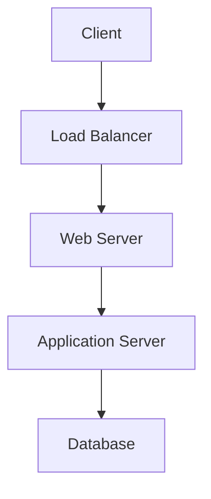
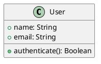
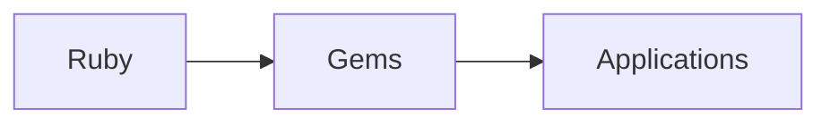

# Ruby Guide Diagrams

This directory contains technical diagrams and visualizations that help explain Ruby programming concepts, architecture patterns, and system designs.

## Available Diagrams

### Ruby Fundamentals
- **ruby-object-model.png**: Visual representation of Ruby's object model and inheritance hierarchy
- **method-lookup-chain.png**: How Ruby finds methods in the inheritance chain
- **block-proc-lambda.png**: Differences between blocks, procs, and lambdas
- **metaprogramming-concepts.png**: Ruby metaprogramming techniques and concepts

### Ruby on Rails
- **rails-request-lifecycle.png**: Complete HTTP request flow through Rails
- **mvc-architecture.png**: Model-View-Controller pattern in Rails
- **active-record-associations.png**: Database relationship types and associations
- **rails-directory-structure.png**: Organization of Rails application files

### Web Development
- **http-request-response.png**: HTTP protocol flow and status codes
- **rest-api-design.png**: RESTful API design principles and patterns
- **authentication-flow.png**: User authentication and authorization processes
- **session-management.png**: Web session handling and security

### Database Design
- **database-schema.png**: Example database schema design
- **sql-joins.png**: Visual explanation of SQL join types
- **normalization-forms.png**: Database normalization levels
- **indexing-strategies.png**: Database indexing techniques

### System Architecture
- **microservices-pattern.png**: Microservices architecture overview
- **client-server-architecture.png**: Client-server model components
- **load-balancing.png**: Load balancing strategies and algorithms
- **caching-strategies.png**: Different caching approaches and patterns

### Development Workflow
- **git-workflow.png`: Git branching and merging strategies
- **ci-cd-pipeline.png**: Continuous integration and deployment flow
- **testing-pyramid.png**: Testing strategy and test types
- **code-review-process.png**: Code review workflow and best practices

## Diagram Formats

### Mermaid Diagrams
Many diagrams are created using Mermaid syntax for easy maintenance:



### PlantUML
For UML diagrams and complex technical visualizations:



### SVG Graphics
Scalable vector graphics for high-quality displays and printing.

## Usage in Documentation

### Referencing Diagrams
To include diagrams in Markdown files:

```markdown

```

### Mermaid Integration
For interactive diagrams using Mermaid:

```markdown

```

## Creating New Diagrams

### Guidelines
1. **Keep it Simple**: Focus on the core concept
2. **Use Consistent Styling**: Maintain visual consistency
3. **Add Descriptions**: Include alt text and captions
4. **Optimize for Web**: Keep file sizes reasonable
5. **Use Standard Symbols**: Follow industry conventions

### Tools Recommended
- **Draw.io**: Free online diagramming tool
- **Mermaid**: Text-based diagram generation
- **PlantUML**: UML diagram creation
- **Graphviz**: Graph visualization software
- **Lucidchart**: Professional diagramming platform

### File Naming
- Use lowercase with hyphens
- Be descriptive but concise
- Include version numbers when relevant
- Use .png for raster images, .svg for vector graphics

## Diagram Categories

### Conceptual Diagrams
Explain abstract concepts and relationships:
- Object-oriented programming concepts
- Design patterns
- Algorithm visualizations
- Data structures

### Technical Diagrams
Show technical implementations:
- System architecture
- Network topologies
- Database schemas
- API designs

### Process Diagrams
Illustrate workflows and processes:
- Development workflows
- Deployment processes
- User interactions
- Data flows

## Maintenance

### Regular Updates
- Review diagrams for accuracy
- Update with new Ruby versions
- Refresh styling and colors
- Add new diagrams as needed

### Quality Checks
- Ensure all diagrams are readable
- Check for broken links
- Verify file sizes are reasonable
- Test in different viewing contexts

## Contributing

When adding new diagrams:

1. Check existing diagrams first
2. Choose appropriate category
3. Follow naming conventions
4. Include descriptions in this README
5. Update main documentation references
6. Test diagram rendering

## Technical Specifications

### Image Requirements
- **Resolution**: Minimum 72 DPI for web, 300 DPI for print
- **Format**: PNG for screenshots, SVG for diagrams
- **Size**: Keep under 500KB for web use
- **Colors**: Use accessible color schemes

### Accessibility
- Include alt text for all images
- Use high contrast colors
- Provide text descriptions when needed
- Test with screen readers

## Diagram Descriptions

### Ruby Object Model
Shows the relationship between BasicObject, Object, Module, and Class in Ruby's object hierarchy.

### Rails Request Lifecycle
Illustrates the complete flow of an HTTP request from browser to Rails application and back.

### MVC Architecture
Demonstrates the separation of concerns in Model-View-Controller pattern.

### Git Workflow
Visualizes common Git branching strategies like Git Flow and GitHub Flow.

### Testing Pyramid
Shows the recommended proportions of unit, integration, and end-to-end tests.

## Resources

### Diagramming Tools
- [Mermaid Documentation](https://mermaid-js.github.io/)
- [PlantUML Reference](http://plantuml.com/)
- [Draw.io](https://draw.io/)
- [Graphviz](https://graphviz.org/)

### Design Resources
- [UI Design Principles](https://www.nngroup.com/)
- [Color Accessibility](https://webaim.org/resources/contrastchecker/)
- [Icon Libraries](https://fontawesome.com/)

### Ruby-Specific Resources
- [Ruby Documentation](https://www.ruby-lang.org/en/documentation/)
- [Rails Guides](https://guides.rubyonrails.org/)
- [Ruby Style Guide](https://rubystyle.guide/)
